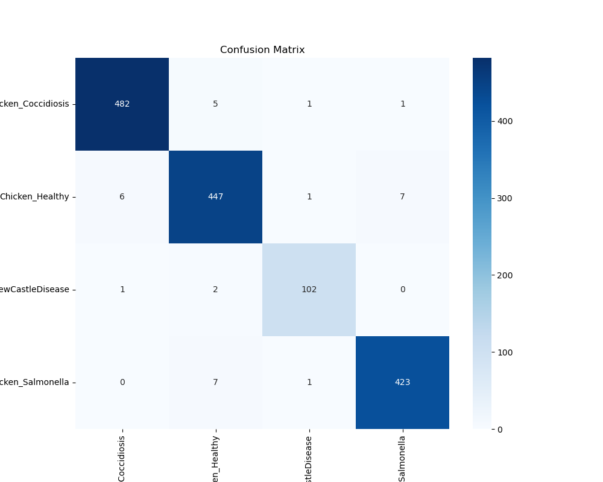

# ChickenHealthAI

<div align="center">


<br/>
<br/>

### Intelligent Poultry Health Monitoring System

<p align="center">
  
  
  
  
</p>

</div>

---

## 📋 Table of Contents

- [Overview](#-overview)
- [Key Features](#-key-features)
- [Application Screenshots](#-application-screenshots)
- [System Architecture](#-system-architecture)
- [Technology Stack](#-technology-stack)
- [Installation Guide](#-installation-guide)
- [API Reference](#-api-reference)
- [Performance Results](#-performance-results)
- [Training Methodology](#-training-methodology)
- [System Advantages](#-system-advantages)
- [Future Development](#-future-development)
- [License](#-license)
- [Acknowledgements](#-acknowledgements)

---

## 🔍 Overview

ChickenHealthAI is an advanced poultry health monitoring system that leverages artificial intelligence to detect and classify chicken health conditions through fecal image analysis. Using the state-of-the-art Vision Transformer (ViT-B/16) architecture, the system provides accurate and reliable disease detection for poultry farmers.

The system achieves a remarkable 97.85% accuracy in identifying four critical health conditions:

| Condition | Description |
|-----------|-------------|
| 🟢 **Healthy** | Normal healthy condition with no signs of disease |
| 🔴 **Coccidiosis** | Parasitic disease affecting the intestinal tract |
| 🟠 **Newcastle Disease** | Viral infection impacting respiratory and nervous systems |
| 🟣 **Salmonella** | Bacterial infection causing food poisoning and potential health hazards |

Based on the foundational research from DeepPoultryInsight, our model incorporates significant optimizations and architectural enhancements to improve classification accuracy and real-world performance.


---

## ✨ Key Features

### Backend Excellence

- **High-Performance API**: REST architecture built with FastAPI for reliable and fast predictions
- **Advanced AI Model**: Implemented Vision Transformer (ViT-B/16) with state-of-the-art performance
- **Real-Time Processing**: Optimized image processing pipeline with minimal latency
- **Developer-Friendly**: Comprehensive API documentation with interactive Swagger UI
- **High Reliability**: Robust error handling and prediction confidence scoring
- **Scalable Architecture**: Designed for horizontal scaling to handle multiple concurrent requests

### User-Centric Mobile App

- **Intuitive Design**: Clean, modern interface following Material Design principles
- **Flexible Input**: Capture images directly or select from gallery
- **Visual Analytics**: Color-coded results with probability visualization
- **Persistent History**: Comprehensive examination history with filtering options
- **Detailed Insights**: In-depth health condition descriptions with professional recommendations
- **Offline Capability**: Core functionality available in limited-connectivity environments


---

## 📱 Application Screenshots

<div align="center">
  <div style="display: flex; justify-content: center;">
    
    
    
  </div>
  <p>
    <code>Home Screen</code>&nbsp;&nbsp;&nbsp;&nbsp;&nbsp;&nbsp;&nbsp;&nbsp;&nbsp;&nbsp;&nbsp;&nbsp;&nbsp;&nbsp;&nbsp;&nbsp;&nbsp;&nbsp;
    <code>Detection Results</code>&nbsp;&nbsp;&nbsp;&nbsp;&nbsp;&nbsp;&nbsp;&nbsp;&nbsp;&nbsp;&nbsp;&nbsp;&nbsp;&nbsp;&nbsp;&nbsp;&nbsp;&nbsp;
    <code>History Dashboard</code>
  </p>
</div>


---

## 🏗️ System Architecture

ChickenHealthAI employs a modern client-server architecture optimized for mobile environments:


### Data Flow
1. User captures chicken fecal image through the Flutter application
2. Image is compressed and sent to the FastAPI backend via REST API
3. Backend preprocesses the image (resizing, normalization)
4. Optimized ViT-B/16 model performs inference on the processed image
5. Classification results with confidence scores are generated
6. Results are returned to the mobile application as a structured JSON response
7. App presents results with visual indicators and stores the record in local history


---

## 🧪 Technology Stack

### AI & Machine Learning
- **Model Architecture**: Vision Transformer (ViT-B/16)
- **Framework**: PyTorch 2.1
- **Supporting Libraries**: torchvision, timm
- **Transfer Learning**: Fine-tuned from pre-trained ImageNet weights
- **Performance**: 97.85% validation accuracy

### Backend Infrastructure
- **API Framework**: FastAPI
- **Server**: Uvicorn (ASGI)
- **Security**: API key authentication, CORS protection
- **Documentation**: OpenAPI (Swagger UI)
- **Containerization**: Docker
- **Deployment**: Kubernetes-ready

### Mobile Application
- **Framework**: Flutter 3.14
- **State Management**: Provider pattern
- **Network**: HTTP client with retry logic
- **Storage**: SQLite via shared_preferences
- **UI Components**: Material Design 3
- **Image Processing**: image_picker with compression
- **Typography**: Google Fonts (Poppins)
- **Animations**: flutter_animate


---

## 🚀 Installation Guide

### Prerequisites
- Python 3.9+
- Flutter 3.10+
- Docker (optional)

### Backend Setup

```bash
# Clone the repository
git clone https://github.com/ImmanuelPartogi/Poultry-Health-Classification-System

# Install dependencies
pip install -r requirements.txt

# Download pre-trained model
mkdir -p models
wget -O models/best_vit_chicken_classifier.pth https://github.com/ImmanuelPartogi/DeepPoultryInsight

# Start the server
uvicorn app.main:app --reload --host 0.0.0.0 --port 8000
```

### Mobile App Setup
```bash
# Navigate to app directory
# Install dependencies
flutter pub get

# Run the app in development
flutter run

```


---

## 📡 API Reference

### Endpoints

| Endpoint | Method | Description |
|----------|--------|-------------|
| `/health` | GET | API health check and status |
| `/info` | GET | Model and system information |
| `/predict` | POST | Disease classification from image |
| `/feedback` | POST | Submit feedback on prediction |


## 📊 Performance Results

### Model Metrics
- **Accuracy**: 97.85%
- **F1 Score**: 0.98
- **Precision**: 0.98
- **Recall**: 0.98
- **Inference Time**: 157ms (avg. on NVIDIA T4)

### Class-Specific Performance

| Disease Class | Precision | Recall | F1-Score | Support |
|---------------|-----------|--------|----------|---------|
| Chicken_Coccidiosis | 0.99 | 0.99 | 0.99 | 489 |
| Chicken_Healthy | 0.97 | 0.97 | 0.97 | 461 |
| Chicken_NewCastleDisease | 0.97 | 0.97 | 0.97 | 105 |
| Chicken_Salmonella | 0.98 | 0.98 | 0.98 | 431 |

### Confusion Matrix
<p align="center">
  
</p>

### Training Performance
<p align="center">
  
</p>


---

## 🧠 Training Methodology

Our model was trained using a sophisticated two-phase fine-tuning approach:

### Dataset Composition
- **Total Images**: 7,427 chicken fecal samples
- **Training Split**: 5,941 images (80%)
- **Validation Split**: 1,486 images (20%)
- **Class Distribution**:

| Class | Count | Percentage |
|-------|-------|------------|
| Chicken_Coccidiosis | 2,402 | 32.3% |
| Chicken_Healthy | 2,331 | 31.4% |
| Chicken_NewCastleDisease | 525 | 7.1% |
| Chicken_Salmonella | 2,169 | 29.2% |

### Phase 1: Head Classifier Training
- Frozen backbone weights
- Trainable classification head
- 5 epochs
- Learning rate: 1e-4
- Optimizer: Adam
- Batch size: 32

### Phase 2: Fine-Tuning
- Unfrozen last 2 transformer blocks
- 15 epochs
- Learning rate: 1e-5 with scheduler
- Scheduler: CosineAnnealingLR
- Batch size: 16
- Early stopping (patience=3)

### Data Preprocessing Pipeline
```python
transform_train = transforms.Compose([
    transforms.Resize((224, 224)),
    transforms.RandomHorizontalFlip(p=0.5),
    transforms.RandomVerticalFlip(p=0.2),
    transforms.RandomRotation(degrees=15),
    transforms.ColorJitter(brightness=0.1, contrast=0.1, saturation=0.1, hue=0.05),
    transforms.ToTensor(),
    transforms.Normalize([0.485, 0.456, 0.406], [0.229, 0.224, 0.225])
])
```


---

## 🌟 System Advantages

### Technical Superiority
- **State-of-the-Art Accuracy**: 97.85% classification accuracy exceeds current industry benchmarks
- **Optimized Performance**: Inference time under 2 seconds on mid-range mobile devices
- **Low Resource Requirements**: Efficient model optimization enables deployment on resource-constrained environments
- **Cross-Platform Compatibility**: Single codebase for Android and iOS deployment

### Practical Benefits
- **Early Disease Detection**: Identify health issues before visible symptoms appear
- **Reduced Mortality Rate**: Early intervention can reduce flock mortality by up to 30%
- **Lower Treatment Costs**: Targeted treatment based on specific disease identification
- **Improved Farm Productivity**: Continuous health monitoring leads to improved yield
- **Accessibility**: User-friendly interface requires minimal technical knowledge


---

## 📈 Future Development

Our roadmap for future enhancements includes:

### Short-term Goals (2025 Q3)
- Multi-disease detection capability
- Cloud synchronization for backup and analytics
- Enhanced visualization of disease progression
- Offline mode with full functionality

### Mid-term Vision (2026)
- Integration with farm management systems
- Predictive analytics for disease outbreak prevention
- Extended support for additional poultry species
- Veterinarian portal for remote consultation

### Long-term Initiatives
- Community-contributed disease database
- Blockchain verification for diagnosis authenticity
- Satellite integration for environmental correlation analysis
- Research partnerships for model continuous improvement


---

## 📄 License

```

Copyright (c) 2025 ChickenHealthAI

Permission is hereby granted, free of charge, to any person obtaining a copy
of this software and associated documentation files (the "Software"), to deal
in the Software without restriction, including without limitation the rights
to use, copy, modify, merge, publish, distribute, sublicense, and/or sell
copies of the Software, and to permit persons to whom the Software is
furnished to do so, subject to the following conditions:

The above copyright notice and this permission notice shall be included in all
copies or substantial portions of the Software.

THE SOFTWARE IS PROVIDED "AS IS", WITHOUT WARRANTY OF ANY KIND, EXPRESS OR
IMPLIED, INCLUDING BUT NOT LIMITED TO THE WARRANTIES OF MERCHANTABILITY,
FITNESS FOR A PARTICULAR PURPOSE AND NONINFRINGEMENT. IN NO EVENT SHALL THE
AUTHORS OR COPYRIGHT HOLDERS BE LIABLE FOR ANY CLAIM, DAMAGES OR OTHER
LIABILITY, WHETHER IN AN ACTION OF CONTRACT, TORT OR OTHERWISE, ARISING FROM,
OUT OF OR IN CONNECTION WITH THE SOFTWARE OR THE USE OR OTHER DEALINGS IN THE
SOFTWARE.
```


---

## 🙏 Acknowledgements

gratitude to the following resources and contributors:

- **Research Foundation**: DeepPoultryInsight for the foundational research
- **Dataset**: Chicken Feces Image Dataset consortium
- **Academic Partners**: University of Agricultural Sciences
- **Technical Dependencies**:
  - PyTorch Team
  - timm Library
  - FastAPI Framework
  - Flutter Community
- **Special Thanks**: To all poultry farmers who provided valuable feedback during beta testing

---

<div align="center">
  <p>
    <a href="https://github.com/ImmanuelPartogi/Poultry-Health-Classification-System/issues">Report Bug</a> •
    <a href="https://github.com/ImmanuelPartogi/Poultry-Health-Classification-System/issues">Request Feature</a> •
  </p>
  <sub>© 2025 ChickenHealthAI Team. All rights reserved.</sub>
</div>
